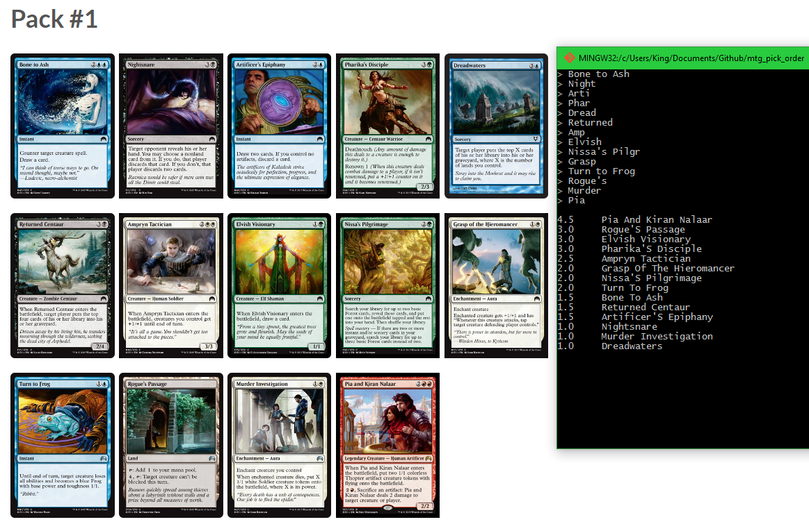

# Magic: the Gathering pick order
For M:tG players who need a quick primer to draft formats they're new to.

This python application allows M:tG players who are new to a format, need a leg up in drafting, or just need a second opinion on comparing two potential first picks, to get a leg up on the competition. Type in names of cards that you want analyzed, and get the card's ranking returned back, on an absolute scale of 0.0 to 5.0.

Controls  
Enter - Input new card (preserves old search results)  
Backspace - Undo previous keystroke, or on empty line, clears the line  
Ctrl + D - Clear line  
Ctrl + C - Exit  

Thanks to Frank Karsten for the initial seed data for Magic: Origins drafts. You can find his analysis [here.](http://www.channelfireball.com/articles/a-pick-order-list-for-magic-origins/)
Thanks to LSV for the updated seed data for Magic: Origins drafts and the DTK set. You can find his articles [here.](http://www.channelfireball.com/author/luis-scott-vargas/)
Thanks to TCGPlayer for the pick orders for 3xZEN. You can find the original data [here.](http://magic.tcgplayer.com/strategy/draft-091006.asp) Do note that this data is missing lands and artifacts in the analysis.

# Example
Here's a sample P1P1 of a pack of Magic: Origins, provided by ChannelFireball [here.](http://www.channelfireball.com/articles/whats-the-pick-magic-origins-pack-1-pick-1-with-huey-2/)

